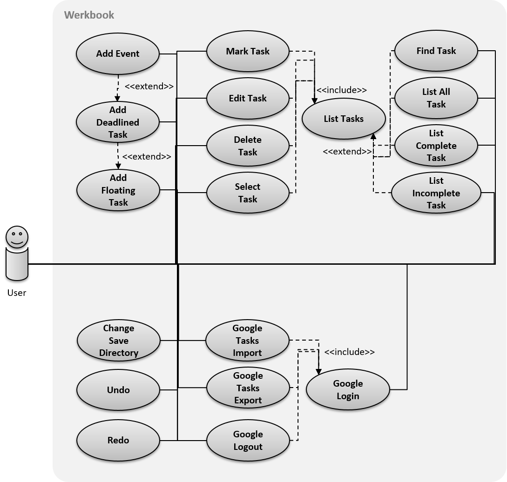

# Appendix B: Use Cases

- [Use Case Diagram](#use-case-diagram)
- [Use Cases](#use-cases)
    - [Add Floating Task](#add-floating-task)
    - [Add Deadline Task](#add-deadline-task)
    - [Add Event](#add-event)
    - [List Tasks](#list-tasks)
    - [Find Tasks](#find-tasks)
    - [List all Tasks](#list-all-tasks)
    - [List complete Tasks](#list-complete-tasks)
    - [List incomplete Tasks](#list-incomplete-tasks)
    - [Select Task](#select-task)
    - [Edit Task](#edit-task)
    - [Mark Task](#mark-task)
    - [Delete Task](#delete-task)
    - [Undo Action](#undo-action)
    - [Redo Action](#redo-action)
    - [Change Save Directory](#change-save-directory)
    - [Google Login](#google-login)
    - [Google Tasks Import](#google-tasks-import)
    - [Google Tasks Export](#google-tasks-export)
    - [Google Logout](#google-logout)

## Use Case Diagram

 

## Use Cases

### Add Floating Task

#### MSS

1. User enters command with name and description of task
2. Werkbook enters task into system  
**Use case ends**

#### Extensions

- [Add Deadline Task](#add-deadline-task) occurs after step 1.

### Add Deadline Task
This use case extends [Add Floating task](#add-floating-task). It is inserted at extension point Add Deadline Task.

#### MSS

1. User enters parameters for end date/time  
**Use case continues in step 2 of [Add Floating Task](#add-floating-task)**

#### Extensions

1a. End date/time is in the wrong format
> 1a1. Werkbook shows an error message  
  **Use case ends**

- [Add Event](#add-event) occurs after step 1.

### Add Event

This use case extends [Add Deadline Task](#add-deadline-task). It is inserted at extension point Add Event.

#### MSS

1. User enters parameters for start date/time  
**Use case continues after step 1 of [Add Deadline Task](#add-deadline-task)**

#### Extensions

1a. Start date/time is in the wrong format
> 1a1. Werkbook shows an error message  
  **Use case ends**

### List Tasks

#### MSS

1. Werkbook shows the list of tasks  
**Use case ends**

- [Find Tasks](#find-tasks) occurs before step 1
- [List all Tasks](#list-all-tasks) occurs before step 1
- [List complete Tasks](#list-complete-tasks) occurs before step 1
- [List incomplete Tasks](#list-incomplete-tasks) occurs before step 1

### Find Tasks

This use case extends [List Tasks](#list-tasks). It is inserted at extension point Find Tasks.

#### MSS

1. User requests to find tasks by keyword
2. Werkbook shows a list of tasks with keywords that match the exact keyword  
**Use Case continues in step 1 of [List Tasks](#list-tasks)**

#### Extensions

2a. No tasks match the specified keywords
> 2a1. Werkbook shows a notice message  
  **Use case ends**

### List all Tasks

This use case extends [List Tasks](#list-tasks). It is inserted at extension point List all tasks.

#### MSS

1. User request to list all tasks
2. Werkbook retrieves all tasks  
**Use Case continues in step 1 of [List Tasks](#list-tasks)**

#### Extensions

2a. There are no tasks
> 2a1. Werkbook shows a notice message  
  **Use case ends**

### List complete Tasks

This use case extends [List Tasks](#list-tasks). It is inserted at extension point List complete tasks.

#### MSS

1. User request to list complete tasks
2. Werkbook retrieves complete tasks  
**Use Case continues in step 1 of [List Tasks](#list-tasks)**

#### Extensions

2a. There are no tasks
> 2a1. Werkbook shows a notice message  
  **Use case ends**

### List incomplete Tasks

This use case extends [List Tasks](#list-tasks). It is inserted at extension point List incomplete tasks.

#### MSS

1. User request to list incomplete tasks
2. Werkbook retrieves all tasks  
**Use Case continues in step 1 of [List Tasks](#list-tasks)**

#### Extensions

2a. There are no tasks
> 2a1. Werkbook shows a notice message  
  **Use case ends**

### Select Task

#### MSS

1. User retrieves list of tasks [via Use Case: List Tasks](#list-tasks)
2. User selects a task using its index
3. Werkbook retrieves the full details of the task  

#### Extensions

3a. No tasks match the index
> 2a1. Werkbook shows a notice message  
  **Use case ends**

### Edit Task

#### MSS

1. User retrieves list of tasks [via Use Case: List Tasks](#list-tasks)
2. User enters command to edit task
3. Werkbook edits task according to given parameters  
**Use case ends**

#### Extensions

2a. The given index is invalid
> 2a1. Werkbook shows an error message  
  **Use case resumes at step 2**

2b. The given parameters are invalid

 > 2b1. Werkbook shows an error message  
  **Use case resumes at step 2**

### Mark Task

1. User retrieves list of tasks [via Use Case: List Tasks](#list-tasks)
2. User enters command to mark task
3. Werkbook marks specified task from incomplete to complete or vice versa  
**Use case ends**

#### Extensions

2a. The given index is invalid
> 2a1. Werkbook shows an error message  
  **Use case resumes at step 2**

### Delete Task

#### MSS

1. User retrieves list of tasks [via Use Case: List Tasks](#list-tasks)
2. User enters command to delete task
3. Werkbook deletes specified task  
**Use case ends**

#### Extensions

2a. The given index is invalid
> 2a1. Werkbook shows an error message  
  **Use case resumes at step 2**

### Undo Action

#### MSS

1. User requests to undo the previous action
2. Werkbook undos the last action
3. Werkbook shows the reflected changes  
**Use case ends**

#### Extensions

2a. There exists no valid action that can be undone
> 2a1. Werkbook shows a notice message  
  **Use case ends**

### Redo Action

#### MSS

1. User requests to redo the previous undo
2. Werkbook redos the previous undo
3. Werkbook shows the reflected changes  
**Use case ends**

#### Extensions

2a. There exists no valid undo action that can be redone
> 2a1. Werkbook shows a notice message  
  **Use case ends**

### Change Save Directory

#### MSS

1. User enters command to save to specified directory
2. All data is then relocated to the specified location 
**Use case ends**

#### Extensions

1a. Directory does not exist
> 1a1. Werkbook shows a notice message  
  **Use case ends**

### Google Login

#### MSS

1. User enters command to login to Google
2. Werkbook launches a web page asking for access
3. User approves Werbook access
4. Werkbook saves user's credentials 
**Use case ends**

#### Extensions

3a. User denies access
> 3a1. Werkbook shows an error message  
  **Use case ends**

### Google Tasks Import

#### MSS

1. User logs in [via Use Case: Google Login](#google-login)
2. User enters command to import tasks from Google
3. Werkbook clears tasks and add all the tasks from Google
**Use case ends**

#### Extensions

1a. User is not logged in
> 1a1. Werkbook shows an error message  
  **Use case ends**

### Google Tasks Export

#### MSS

1. User logs in [via Use Case: Google Login](#google-login)
2. User enters command to export tasks to Google
3. Werkbook clears tasks that were on Google tasks and add tasks from Werkbook to Google Tasks
**Use case ends**

#### Extensions

1a. User is not logged in
> 1a1. Werkbook shows an error message  
  **Use case ends**

### Google Logout

#### MSS

1. User is logged in [via Use Case: Google Login](#google-login)
2. User enters command to logout
3. Werkbook clears user's credentials
**Use case ends**

#### Extensions

1a. User is not logged in
> 1a1. Werkbook shows an error message  
  **Use case ends**
