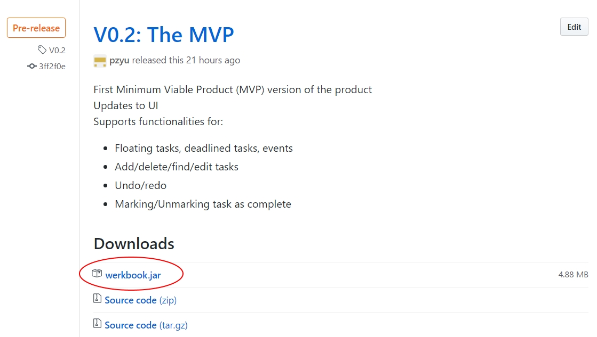
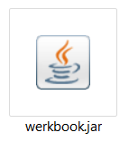
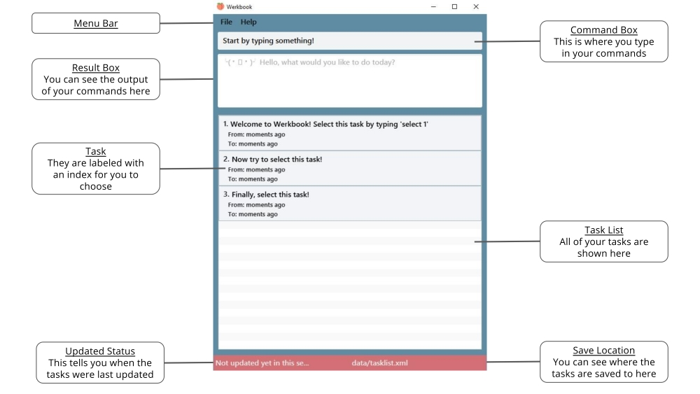

# Werkbook - User Guide

By : `Team W15B2`  &nbsp;&nbsp;&nbsp;&nbsp; Since: `Mar 2017`  &nbsp;&nbsp;&nbsp;&nbsp; Licence: `MIT`

---

1. [Welcome](#1-welcome)
2. [Getting Started](#2-getting-started)
    1. [Installation](#i-installation)
    2. [Starting Werkbook](#ii-starting-werkbook)
    3. [Interface Introduction](#iii-interface-introduction)
    4. [Quick Start](#iv-quick-start)
3. [User Interface](#3-user-interface)
4. [Features](#4-features)
    1. [Task Management](#i-task-management)
        1. [Add task](#a-add-task)
        2. [List tasks](#b-list-tasks)
        3. [Edit task](#c-edit-task)
        4. [Find task](#d-find-task)
        5. [Select task](#e-select-task)
        6. [Mark task](#f-mark-task)
        7. [Delete task](#g-delete-task)
        8. [Clear all tasks](#h-clear-all-tasks)
    2. [Program Usage](#ii-program-usage)
        1. [Help](#a-help)
        2. [Undo/Redo](#b-undo-redo)
        3. [Change save location](#c-change-save-location)
        4. [Exit program](#d-exit-program)
5. [FAQ](#5-faq)
6. [Commands Cheatsheet](#6-commands-cheatsheet)

## 1. Welcome

Werkbook is a task manager for you to manage their schedules and tasks via a command-line interface.
With just a single line of command, you can add, manipulate, and organize tasks in a hassle-free manner! Werkbook is a simple, yet fast and powerful tool that will help you increase your productivity.

Let Werkbook werk your work!

## 2. Getting Started

### i. Installation
Ensure you have Java version `1.8.0_60` or later installed in your Computer.
> Having any Java 8 version is not enough. 
> This app will not work with earlier versions of Java 8.

Download the latest `werkbook.jar` from the [Releases](../../../releases) tab as shown in *Figure 1* below.

 
*Figure 1: Latest release*

Copy the file to the folder you want to use as the home folder for your Werkbook.

### ii. Starting Werkbook
To start Werkbook, simply double click on `werkbook.jar`.

 
*Figure 2: Launching werkbook.jar*

### iii. Interface Introduction
After launching Werkbook, you will be greeted with the main interface. There will be a short tutorial for you to follow so be sure to follow those instructions!

 
*Figure 3: Werkbook's main interface*

### iv. Quick Start
Here's a quick guide to get you started with Werkbook.

**Adding your first task**

Let's start by adding a new task to Werkbook. Perhaps you want to remind yourself to get the groceries, you can type the following command in the **Command Box**:

`> add Get Groceries`

Notice how when you first type in the letter `a`, a list of commands containing the letter `a` automatically shows up below?

Be sure to make use of this handy autocomplete feature to familiarize yourself with the commands!

**Making changes**

Now, say you want to get the groceries done by tonight, you can edit the task by using the following command:

`> edit 1 by tonight`

Werkbook supports natural language input, so you can tell it what to do just like how you talk to another person. Telling Werkbook that you want to get the task done by tonight, will automatically set the deadline to 8pm on the same day.
Alternatively, if you feel like you're up task, you can also provide an earlier time such as `7pm`, `1900`, `3 hours later`. You can learn more about the different ways you can specify the time in the [Features](#4-features) section.

**Completing a task**

Once you've finished getting the groceries, it's time to mark it as complete by typing the following command:

`> mark 1`

**Deleting a task**

At the end of the day, you can delete the task as simply as typing in:

`> delete 1`

**Still feeling lost?**

Typing `help` in the **Command Box** will bring up the help window with a list of all of the available commands.

**Ready to go!**

Now you're all set to start managing your tasks! Feel free to refer to our [Features](#4-features) section below for details of each command.

## 3. Features

**Command Format**

* Words in `UPPER_CASE` are the parameters.
* Items in `SQUARE_BRACKETS` are optional.
* Items with `...` after them can have multiple instances.
* Parameters can be in any order.

### i. Task Management

#### a. Add task

Once you receive a new task, you can add it to Werkbook using the `add` command. You can also add in an extra description by surrounding it with round brackets. 
Format: `add NAME [(DESCRIPTION)]`

Example: `add Get the groceries (Milk, eggs, and cheese)`

But if you need to get it done by a certain date, use the `by` prefix to let Werkbook know! 
Format: `add NAME [(DESCRIPTION)] [by END_DATETIME]`

Example: `add Get the groceries (Milk, eggs, and cheese) by Tuesday 5pm`

And if you plan to get it done in a particular timespan, you can specify the duration by using `from` and `to`! 
Format: `add NAME [(DESCRIPTION)] [from START_DATETIME] [to END_DATETIME]`

Example: `add Get the groceries (Milk, eggs, and cheese) from Tuesday 5pm to Tuesday 7pm`

> * A task must have a name, while the description is optional 
> * The task can also optionally have a either an end date time, or both a start date time and end date time 

**Acceptable date and time formats**

Formal dates:
> 01/02/2017 
> 5-6-17

Relaxed dates:
> 1st Jan 
> Feb 21st, 2017

Relative dates:
> today 
> tomorrow 
> next Friday 
> next week 
> next month

Time:
> 0600 
> 5pm 
> 4 
> noon 
> tonight 
> midnight

Relative times:
> 5 mins 
> in 10 minutes 
> 15 minutes from now

You can find out more at: http://natty.joestelmach.com/doc.jsp.

#### b. List tasks

The `list` command lets you view your tasks in a list depending on their completion status. 
Format: `list [(complete/incomplete)]`

To see the list of all your tasks, both completed or incomplete, simply type in: 
Example: `list`

For completed tasks, add the `complete` argument at the back
Example: `list complete`

Likewise, for incomplete tasks, add the `incomplete` argument at the back
Example: `list incomplete`

#### c. Edit task

Perhaps the deadline for your project has been pushed back, or maybe you want to change the details of a task that you have already created. You can use the `edit` command to change the description and start/end times of your existing tasks. 
Format: `edit INDEX [NAME] [(DESCRIPTION)] [from START_DATETIME] [to/by END_DATETIME]`

Examples:
* `edit 1 by next monday noon` 
  Edits the deadline of the 1st task to be `next monday 12pm`. 
* `edit 2 (Help to finish up report)` 
  Edits the description of the 2nd task to be `Help to finish up report` 

To remove the start/end date entirely, simply add the corresponding prefix without specifying a new date.

Example:
* `edit 3 by` 
  Removes the deadline from task 3. 

Similarly, to remove a description, add in this prefix without specifying anything.

Example:
* `edit 3 ()` 
  Removes the description from task 3. 

> * Edits the task at the specified `INDEX`.
    The index refers to the index number shown in the last task listing. 
> * At least one of the optional fields must be provided.
> * Existing values will be updated to the input values.

#### d. Find task

Too many tasks? Don't worry! Simply use the `find` command to bring up a list of tasks containing the specified keyword in the name. 
Format: `find KEYWORD [MORE_KEYWORDS]`

Example:
* `find Milk` 
  Retrieves the task `Get the Milk` but not `Get the milk`

> * The search is case sensitive. e.g `milk` will not match `Milk`
> * The order of the keywords does not matter. e.g. `Apple Juice` will match `Juice Apple`
> * Only the name is searched.
> * Only full words will be matched e.g. `Cake` will not match `Cakes`
> * tasks matching at least one keyword will be returned (i.e. `OR` search).
    e.g. `Milk` will match `Get the Milk`

#### e. Select task

Want to review a task you created but it's a little tiring reaching for the mouse? Use the `select` command on a task to view its full description.  
Format: `select INDEX`

Example:
* `select 2`

#### f. Mark task

Finally done with that long and tedious project? Mark it as `Completed` using the `mark` command! 
Format: `mark INDEX`

Example:
* `mark 1` 
  Updates the task status to `Complete` if it is `Incomplete`.  

Oops! Missed out on some project requirements? Just use the `mark` command again to mark the task as `Incomplete` again. 
* `mark 2` 
  Updates the task status to `Incomplete` if it is `Complete`.  

> * Marks the task at the specified `INDEX`.
    The index refers to the index number shown in the last task listing. 
    The index **must be a positive integer** 1, 2, 3, ...

#### g. Delete task

Accidentally added duplicate tasks? Use the `delete` command to remove the specified task from Werkbook. 
Format: `delete INDEX`

Examples:
>`list`
>`delete 2`
* Deletes the 2nd task in the task list.
>`find Report`
>`delete 1`
* Deletes the 1st task in the results of the `find` command.

> * Deletes the task at the specified `INDEX`.  
> * The index refers to the index number shown in the most recent listing. 
> * The index **must be a positive integer** 1, 2, 3, ...

#### h. Clear all tasks

Seeking a fresh start? Use the `clear` command to clear all the tasks in Werkbook and start anew! 
Format: `clear`

### ii. Program Usage

#### a. Help

Displays the help sheet.

Format: `help`

> Help is also shown if you enter an incorrect command e.g. `abcd`

#### b. Undo/Redo

Undo the last command executed.

Format: `undo`

> Undo the last command executed.

Examples:

>`delete 2`
>`undo`
  Undo the deletion of the 2nd task in the task list.

Redo the last undo command(s) executed.

Format: `redo`

> Redo the last undo command executed.

Examples:

>`delete 2`
>`undo`
>`redo`
  The final action would be the deletion of the 2nd task in the task list.

#### c. Change save location

Saves all changes to disk.  
Format: `save SAVE_LOCATION`

Changes where tasks data and user config are saved to specified `SAVE_LOCATION`.

#### d. Exit program

Exits the program. 
Format: `exit`

## 4. FAQ

**Q**: How do I transfer my data to another Computer?

> **A**: Install the app in the other computer and overwrite the empty data file it creates with
       the file that contains the data of your previous task list folder.

**Q**: How do I save my tasks?

> **A**: You don't need to! Your tasks are automatically saved after every command!

## 5. Commands Cheatsheet

Command | Purpose | Format
--- | --- | ---
`add` | Add a task | `add NAME [(DESCRIPTION)] [from START_DATETIME] [to/by END_DATETIME]`
`list` | List tasks based on completion status | `list [(complete/incomplete)]`
`edit` | Edit specified task | `edit INDEX [NAME] [(DESCRIPTION)] [from START_DATETIME] [to/by END_DATETIME]`
`find` | Find tasks based on specified keywords | `find KEYWORD [MORE_KEYWORD]`
`mark` | Mark specified task as complete | `mark INDEX`
`delete` | Delete specified task | `delete INDEX`
`clear` | Clear all tasks | `clear`
`help` | Display help page | `help`
`undo` | Undo command(s) | `undo`
`redo` | Redo command(s) | `redo`
`save` | Change save location | `save SAVE_LOCATION`
`exit` | Exit the program | `exit`
